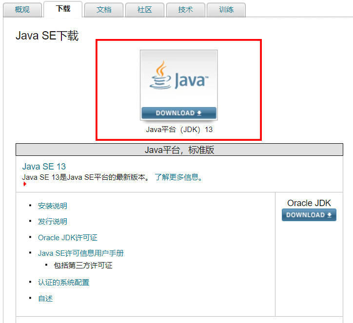
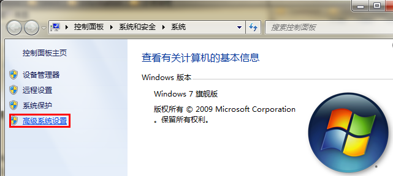
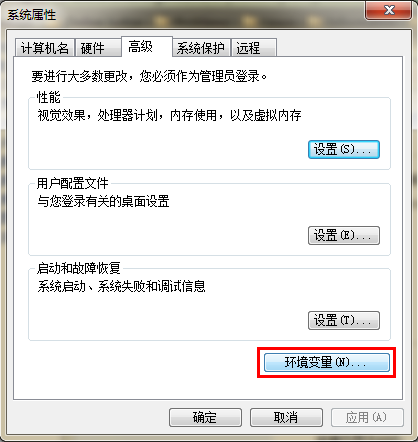
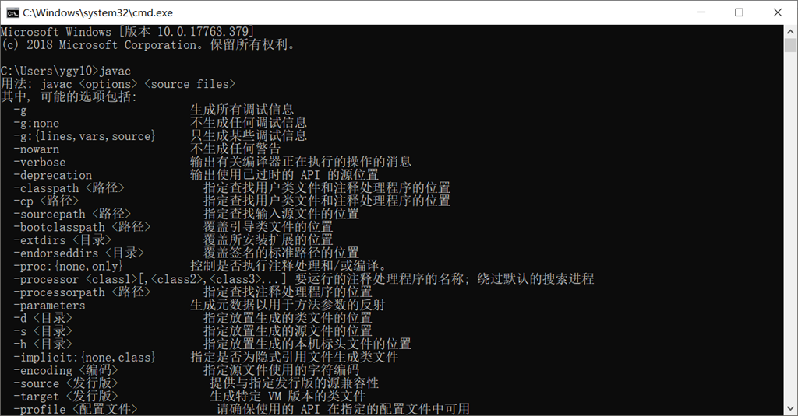

# 第02节：JDK下载与安装

### 前言

同学们上节课我们大致了解了Java的概念与历史这节我们将安装JDK--Java Development Kit（Java开发工具包）与JRE--Java Runtime Environment（Java环境变量）


#### JDK

JDK（Java开发套件）是java开发工具包
JRE（Java Runtime Environment）是Java运行环境
JDK包括JRE，JVM在JRE之内？

Jre是java运行时环境，是java程序的运行环境。既然是运行，当然要包含jvm，也就是大家熟悉的虚拟机啦，还有所有java类库的类文件，都在lib目录下打包成jar 。大家可以自己验证。至于在窗户上的虚拟机是哪个文件呢？学过MFC的都知道什么是DLL文件吧，那么大家看看的jre /斌/客户端里面是不是有一个jvm.dll的呢？那就是虚拟机。

Jdk是java开发包，是java的开发工具包，里面包含了各种类库和工具。当然也包括了另外一个Jre。那么为什么要包括另外一个Jre的呢？而且JDK / JRE / bin中同时有客户端和服务器两个文件夹下都包含一个jvm.dll的。说明是有两个虚拟机的。这一点不知道大家是否注意到了呢？

安装JDK之后，就已经安装了JRE

### 一、下载地址


[JDK的下载地址](https://www.oracle.com/technetwork/java/javase/downloads/index.html)

点击进入下载页面


点击下载按钮（注不用在意大小只需根据自己系统需求下载即可，推荐下载exe文件）：


### 二、安装


### 运行安装包

直接双击，一直下一步即可。

### 配置环境变量

1.安装完成后，右击"我的电脑"，点击"属性"，选择"高级系统设置"；



2.选择"高级"选项卡，点击"环境变量"；


在 "系统变量" 中设置 3 项属性，JAVA_HOME、PATH、CLASSPATH(大小写无所谓),若已存在则点击"编辑"，不存在则点击"新建"。


* 变量名：JAVA_HOME
* 变量值：C:\Program Files (x86)\Java\jdk        // 要根据自己的实际路径配置
* 变量名：CLASSPATH                                 （环境变量是java运行时默认去找的路径，java基本的jar包在里面。配置后可执行cmd中的java命令）
* 变量值：.;%JAVA_HOME%\lib\dt.jar;%JAVA_HOME%\lib\tools.jar;         //记得前面有个"."

在win7中（注Path是在用户变量中如果没有）
* 变量名：Path      （path环境变量--帮助系统操作java）
* 变量值：%JAVA_HOME%\bin;%JAVA_HOME%\jre\bin;

在win10中Path 变量里是分条显示的，我们需要将 %JAVA_HOME%\bin;和%JAVA_HOME%\jre\bin; 分开添加，否则无法识别
```
%JAVA_HOME%\bin
%JAVA_HOME%\jre\bin
```

注:配置完可能需要重启

### 三、JDK目录结构讲解

* bin：存放java可执行文件，
* conf
* include
* jmodes
* legal
* lib

### 四、运行

在cmd控制台输入

``` js
java -version //查询版本
java //执行你编译的class文件。
javac //将java文件编译成class文件
```


出现以下信息则安装成功
