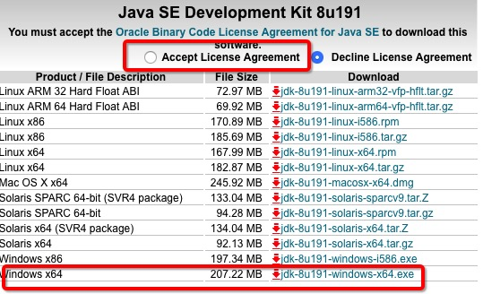

# 第02节：JDK下载与安装

### 一、下载地址


[JDK的下载地址](https://www.oracle.com/technetwork/java/javase/downloads/index.html)

点击下载按钮：


### 二、安装


### 运行安装包

直接双击，一直下一步即可。

### 配置环境变量

1.安装完成后，右击"我的电脑"，点击"属性"，选择"高级系统设置"；


2.选择"高级"选项卡，点击"环境变量"；


在 "系统变量" 中设置 3 项属性，JAVA_HOME、PATH、CLASSPATH(大小写无所谓),若已存在则点击"编辑"，不存在则点击"新建"。


* 变量名：JAVA_HOME
* 变量值：C:\Program Files (x86)\Java\jdk        // 要根据自己的实际路径配置
* 变量名：CLASSPATH
* 变量值：.;%JAVA_HOME%\lib\dt.jar;%JAVA_HOME%\lib\tools.jar;         //记得前面有个"."

在win7中（注Path是在用户变量中如果没有）
* 变量名：Path
* 变量值：%JAVA_HOME%\bin;%JAVA_HOME%\jre\bin;

在win10中Path 变量里是分条显示的，我们需要将 %JAVA_HOME%\bin;和%JAVA_HOME%\jre\bin; 分开添加，否则无法识别
```
%JAVA_HOME%\bin
%JAVA_HOME%\jre\bin
```

注:配置完可能需要重启

### 三、JDK目录结构讲解

* bin：存放java可执行文件，
* conf
* include
* jmodes
* legal
* lib

### 四、运行

在cmd控制台输入

```
java -version
java
javac
```
成功则安装成功