# 第03节：Java开发工具

### 一、常用的开发工具

很多教程最开始都会用技术本演示如何开发Java程序，这里非常不建议使用这种方法。

下来说说常见的Java编辑器

#### eclipse

免费的Java开发编辑器,是一个比较原始的编辑器，这里不推荐使用。

#### myeclipse

myeclipse是在eclipse的基础上做了一些扩展，让Java程序员更方便地开发web应用程序。

#### idea
IDEA 全称 IntelliJ IDEA，是java编程语言开发的集成环境。IntelliJ在业界被公认为最好的java开发工具之一，尤其在智能代码助手、代码自动提示、重构、J2EE支持、各类版本工具(git、svn等)、JUnit、CVS整合、代码分析、 创新的GUI设计等方面的功能可以说是超常的。

#### vscode

VS Code中的Java支持是通过扩展提供的，并通过简单，现代的工作流程针对轻量级Java项目进行了优化
### 二、推荐使用idea

idea是当前最受欢迎Java ide，本手册的所有代码都是推荐使用idea开发。

本手册的所有操作都是基于英文版的idea讲解，所以推荐大家使用英文版idea。
### 三、安装idea
 1. 下载
 进入官网下载适合自己系统的版本，[下载地址](https://www.jetbrains.com/idea/download/#section=windows)。  
 
 2. 安装中选择适合本机的64位（32位）版本，其他一直next即可
 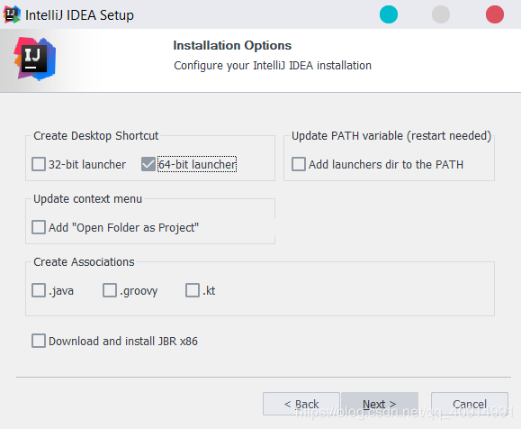
### 四、破解idea
 正版的idea软件是需要收费的，首先强调一遍：各位有能力的请尽量支持正版！ 
 1. 先下载jar包JetbrainsCrack.jar，把它放到你认为合适的文件夹内，我直接放在了安装目录C:\Program Files\JetBrains\IntelliJ IDEA 2019.1\bin。
 JetbrainsCrack.jar[下载地址](https://pan.baidu.com/s/1FiYnAqSdhvSh3nbMZAcHPA)。提取码：2b7a  
 2. 划重点，修改配置文件：不能直接在bin目录下直接修改，先打开idea试用30天，然后点击你要注册的IDE菜单：“Help” -> “Edit Custom VM Options …”，如果提示是否要创建文件，请点"是|Yes"。  
 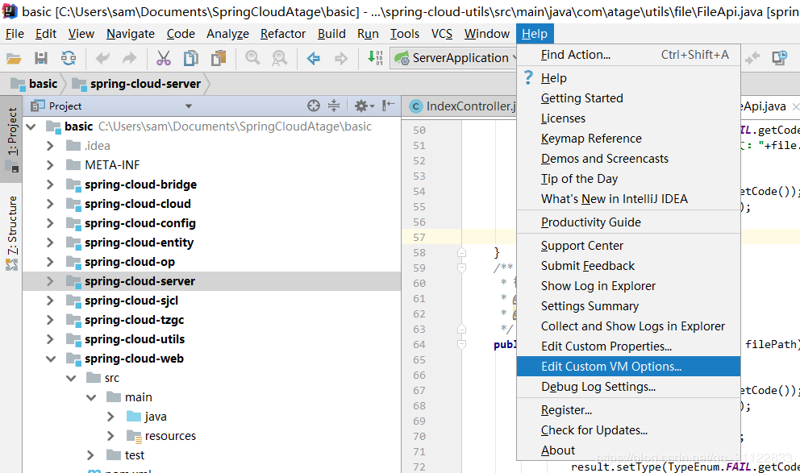
 3. 在打开的vmoptions编辑窗口末行添加：-javaagent:JetbrainsCrack.jar文件的绝对路径（一定要自己确认好路径，填错会导致IDE打不开！！！）  

    如我的路径: -javaagent:C:\Program Files\JetBrains\IntelliJ IDEA 2019.1\bin\JetbrainsCrack.jar  
 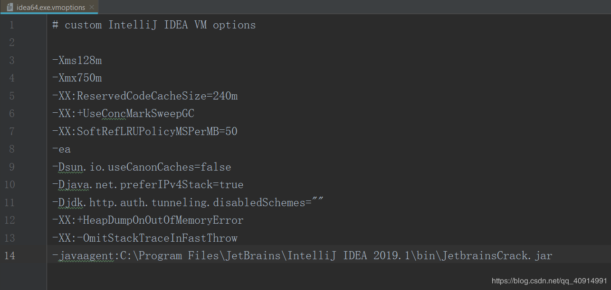
4. 重新启动你的IDEA。  
注册"Help" -> “Register”，选择License server方式，地址填入：http://jetbrains-license-server （应该会自动填上）  
看到Licensed to 用户名，即激活成功。  
#### 创建项目
1. 打开idea软件，点击界面上的Create New Project  
 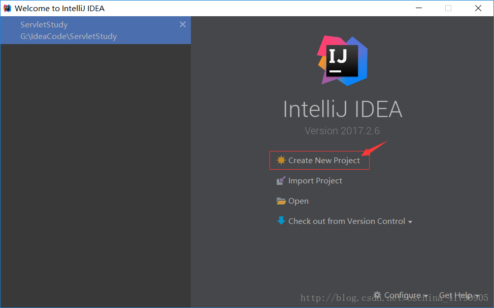  
2. 出现以下界面，选中Java，然后选择jdk，最后点击Next，进行下一步  
 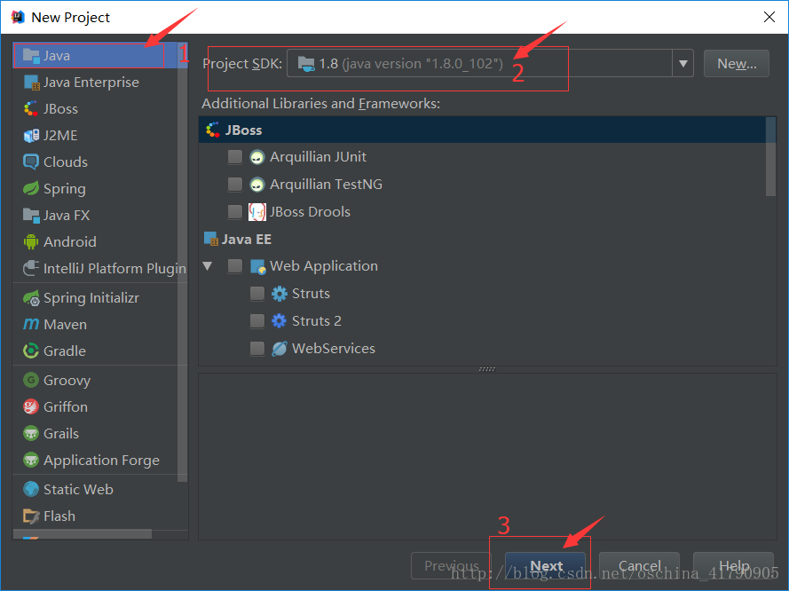  
3. 这里是选择生成项目时是否创建java文件，勾选上Java Hello World后会生成一个默认的Hello world文件，点击Next进行下一步  
 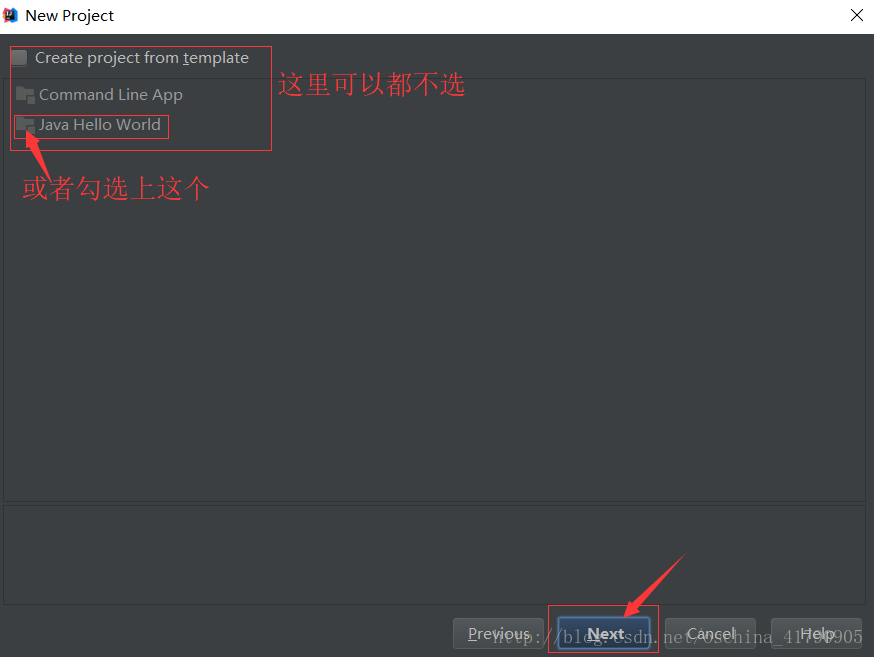  
4. 给项目命名，默认是untiled，自己填个名字吧，最后点击finish  
 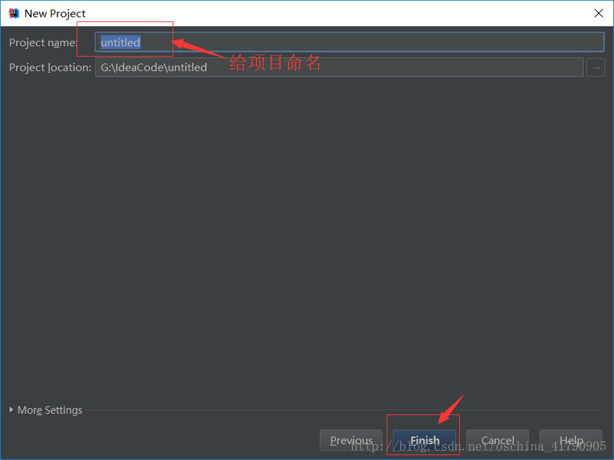  
5. 项目创建完成

#### 运行项目
 1. 点击src——>new——>package，创建一个文件包，并给包命名，与Eclipse的包类似；  
 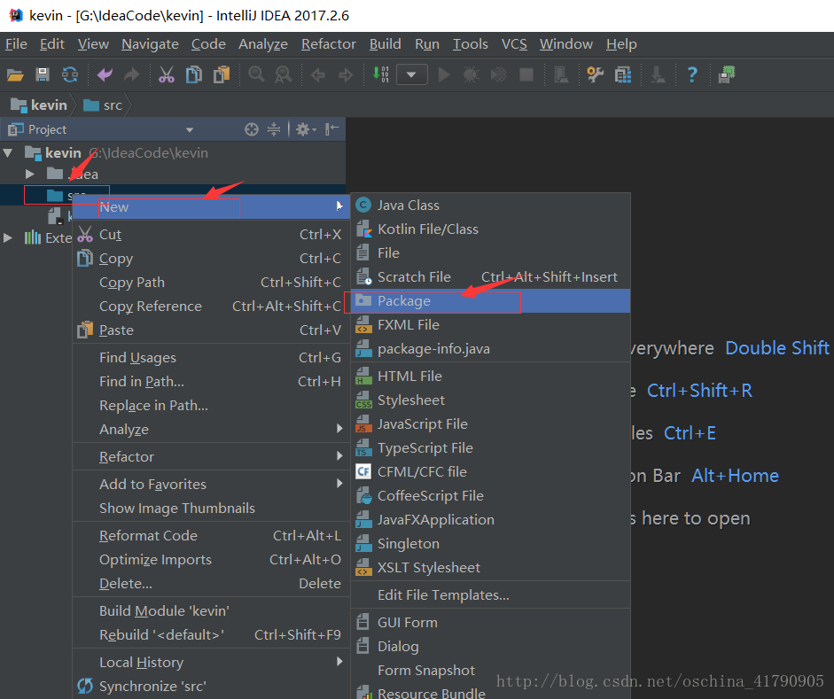  
 2. 在包下面创建java类文件，点击包名——>New——>Java Class;  
   
 3. 写入代码  
 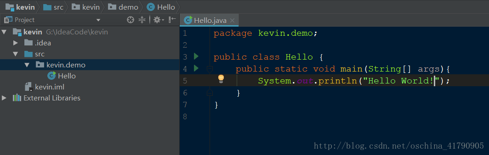  
 4. 运行java文件，点击上方工具栏中的Run——>Run......;
 出现以下弹框，点击要运行的文件名，这里是Hello；  
 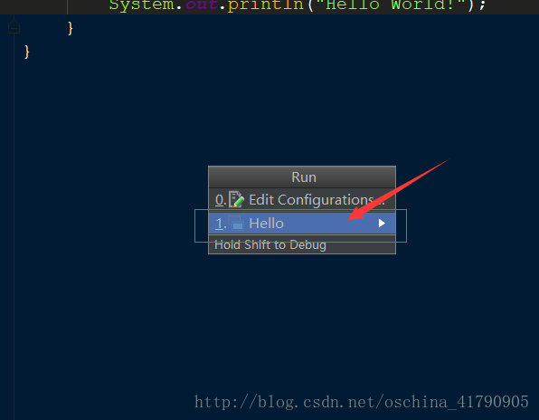  
 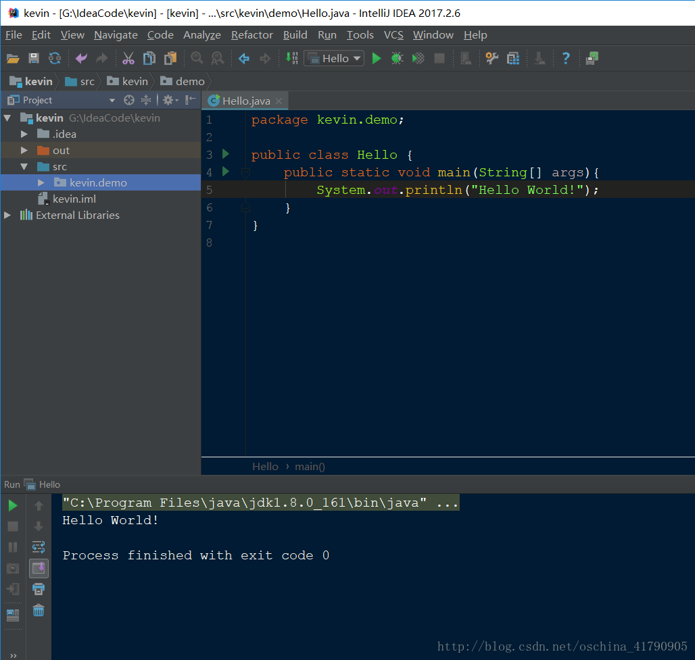  
 5. 运行成功  
 * 注：这里只是教学如何运行项目，让同学们对运行项目的流程有所了解，下一节会为同学们解析这段代码
