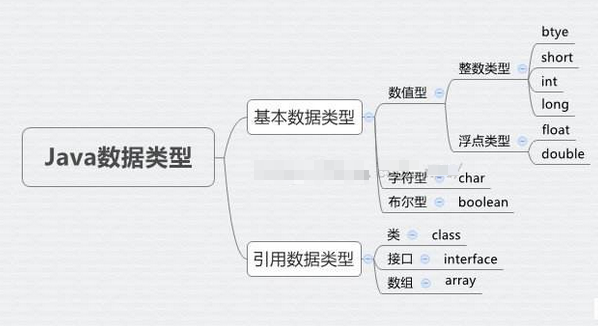

# 第03章：基本类型与引用类型

### 一、再谈数据类型

在第二章中我们学习到数据类型分为【基本数据类型】和【引用数据类型】，这里我们简称基本类型和引用类型。基本类型包括四类八种，这里不再一一介绍，本节我们主要讲解引用类型。并探讨基本类型与引用类型的区别。

### 二、基本类型与引用类型的区别

我们创建了一个类，其实就是新建了一种数据类型，这种数据类型就是引用类型。Java语言中还内置了一些引用类型，例如我们之前接触到的字符串String。

基本数据类型与引用数据类型


基本类型与引用类型数据在内存中的存储方式是不同的，

引用类型的内存单元中只存放对象的地址，而对象本身存贮在内存堆中，只是简单的引用对象的地址。
简而来说基本类型存的是值，引用类型存的是引用，赋值也是如此。


我们来看一个例子。

``` java
//基本数据类型
int num1 = 100; //把100赋值给num1
int num2 = num1;
num1 = 200;
System.out.println(num2);//输出100

//引用数据类型
class Cat{
    String name;
}

class on_Cat {
    public static void main(String[] args) {
        Cat cat1 = new Cat();//这里看起来像把新建的Cat对象赋值给cat1其实只是把Cat对象的引用（即存储Cat对象的地址）赋值给了cat1
        Cat cat2 = cat1;//这里同理cat1是Cat对象的地址
        cat1.name = "Lily";
        System.out.println(cat2.name);//输出Lily
    }
}
```


### 三、基本类型的包装类型

我们学的八种数据类型，还可以对应8种引用类型，这八种引用类型是基本类型的包装类型。

他们分别是Byte，Short，Integer，Long，Float，Double，Character，Boolean。对应关系显而易见。

* byte →	Byte
* short	→	Short
* int	→	Integer
* long →	Long
* float	→	Float
* double	→	Double
* char	→	Character
* boolean →	Boolean


