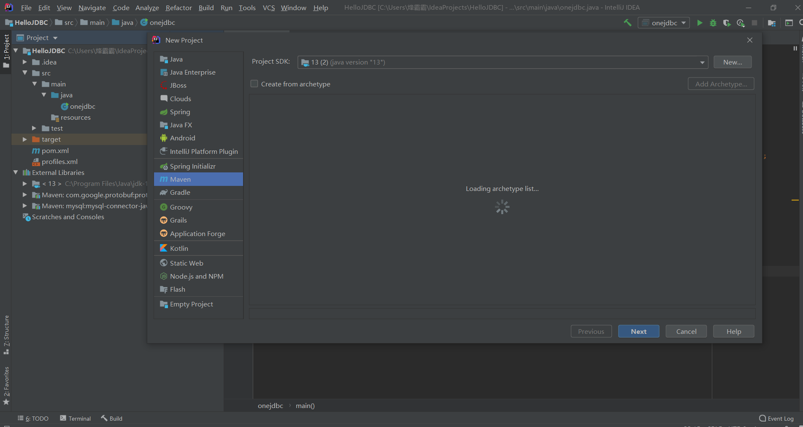
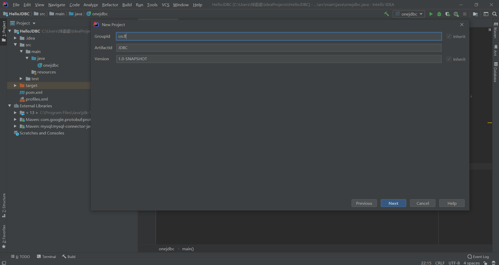
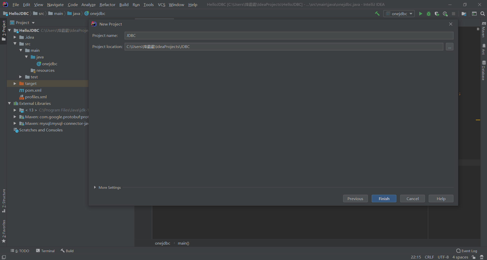
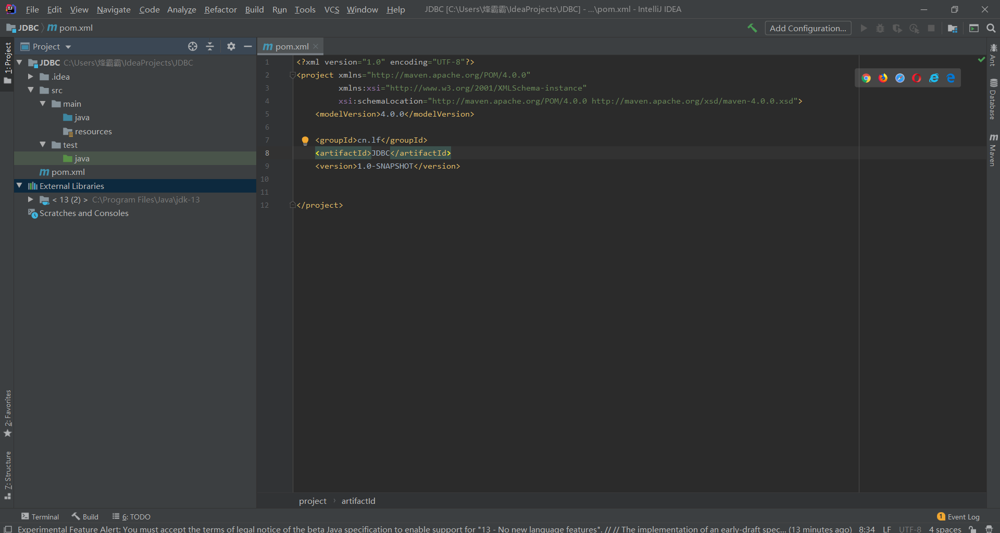
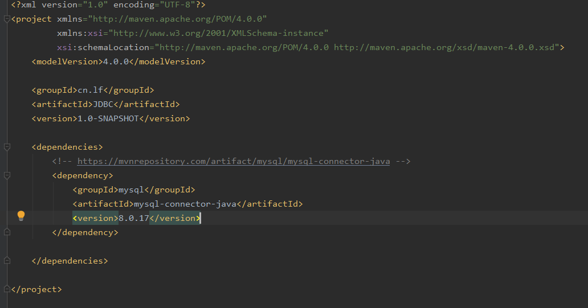
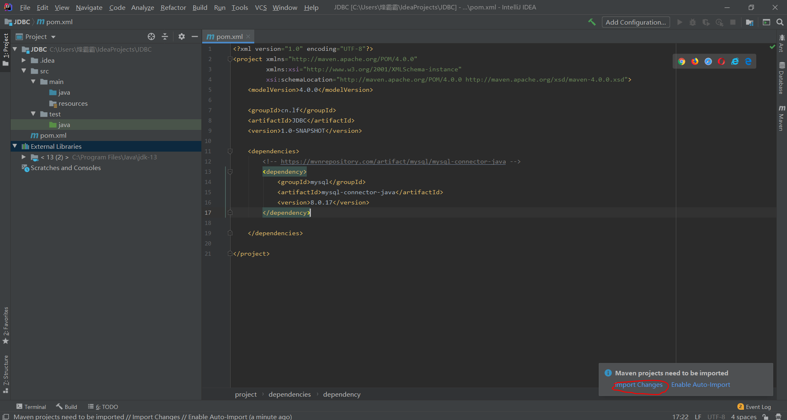
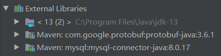

# 第02节：链接数据库

### 一、创建Maven项目  
点击Life>New>Project  
   
GroupId（俗称：包结构）、ArtifactId（俗称：项目名）可以随意命名
  
  
下图是创建成功的样子
  
### 二、配置mysql驱动
1、在dependencies 标签中加入mysql的驱动
  
下面是有mysql驱动的代码网址，自行复制代码  
https://mvnrepository.com/artifact/mysql/mysql-connector-java/8.0.18
当你在标签中粘入mysql会在右下角弹出一个框，点击第一个选项就会下载jar包，这个过程第一次会持续大概20分钟左右
  
下载完成会在External Libraries文件中新增两个Maven文件  
 
### 三、连接数据库的代码
1、在src>main>java，在java里创建一个java class文件  
2、连接数据库的代码  
import java.sql.Connection;  
import java.sql.DriverManager;  
import java.sql.ResultSet;  
import java.sql.Statement;  

public class Hellomysqljdbc {  
    public static void main(String[] args) throws Exception{  
        //注册驱动  
        Class.forName("com.mysql.cj.jdbc.Driver");  
        //获取连接Connection（password里写你自己数据库的密码）  
        Connection conn = DriverManager.getConnection("jdbc:mysql://localhost/jdbc?user=root&password=123456&serverTimezone=UTC");  
        //得到执行sequel语句的对象Statement  
        Statement stmt = conn.createStatement();  
        //执行sql语句，并返回结果(emp是数据库的名字,sql语句根据你自己数据库里面的的数据表来写)  
        ResultSet rs = stmt.executeQuery("select id,name,sex,birthday,salary from emp");  
        //处理结果  
        while(rs.next()) {  
            System.out.println(rs.getObject("id"));  
        }  
        //关闭资源  
        rs.close();  
        stmt.close();  
        conn.close();  
    }  
}  
3、如果遇到发行版本报错请点击[问题解决](https://juejin.im/post/5c7fb897518825408d6feb0d)。  
### 四、

