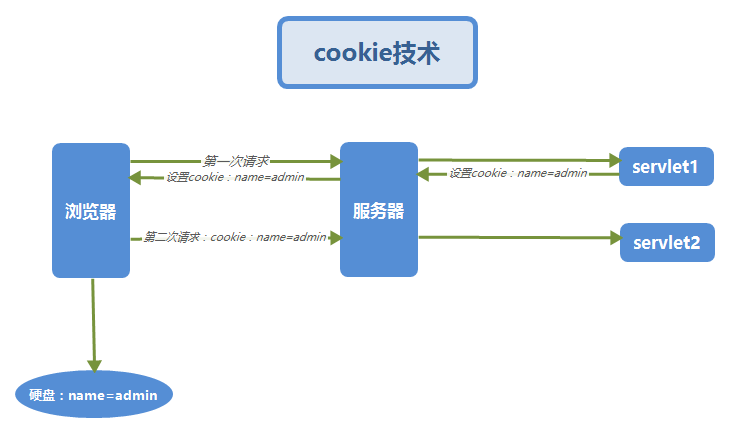

# 第04节：cookie与seesion


### 一、cookie简介  

在登录某个网站时，比如登录163邮箱的网站，界面中有个十天免登陆的选项，先不勾选该选项，登录成功之后关闭浏览器或重启电脑，当再次访问163邮箱时会提示用户登录，这说明http协议是无状态的，在不同的请求之间是无法进行数据传递的。

而当勾选了十天免登陆的选项并登录成功之后，关闭浏览器或者重启电脑，之后再次访问163邮箱时就会自动登录了。这说明用户登录的一些信息保存到了该电脑的硬盘中（默认会存在浏览器的缓存中，可以设置保存在硬盘上），当访问163邮箱网站时，浏览器会将这些数据发送到服务器，从而实现了自动登录的功能，客户端电脑中用于保存这数据的资源，称为cookie。

用户在勾选十天免登陆的选项并登录成功之后，由服务器生成 Cookie，并将其封装到响应头中，以响应的形式发送给浏览器。浏览器接收到这个响应后，将 Cookie 保存到硬盘中。当浏览器再次发送同类请求后，在请求中会携带保存在硬盘的Cookie数据，发送到服务端，由服务器对解析该Cookie。
Cookie 技术并不是 JavaWeb 开发专属技术，而是属于 Web 开发的技术，是所有 Web 开
发语言均支持的技术。Cookie 是由若干键值对构成，这里的键一般称为 name，值称为 value。 Cookie 中的键值对均为字符串。
总的来说cookie的作用就是在客户端存储一些数据，当浏览器再次请求某个服务器时会携带这些数据从而提供更好的用户体验。  
  

#### 在浏览器中删除cookie  
通过火狐浏览器可以查看cookie，点击浏览器右上角的三个横杠–>选项–>隐私–>移除单个cookie，在这个界面中可以删除单个cookie也可以删除全部cookie，删除后，再次登录163网站时会提示输入用户名和密码。在其他浏览器中点击清空浏览器数据之后，也可以删除cookie。  

注意：不同的web服务器在客户端所生成的cookie之间是不能相互访问和共享的。  

#### 在浏览器中cookie的禁用  
浏览器是可以禁用 Cookie 的，即浏览器不接收服务器发送来的 Cookie。现在的很多网站，若浏览器禁用了 Cookie，则将无法访问。火狐浏览器中对于 Cookie 的禁用，是在火狐浏览器的“打开菜单/选项”的“隐私”标签中。不勾选“接受来自站点的 Cookie”，则表示禁用 Cookie。下面代码可以检测出浏览器是否禁用cookie：
``` js
if(navigator.cookieEnabled == true){
        alert("支持cookie");
    }else{
        alert("cookie已被禁用");
    }
```

cookie小知识

一个WEB站点可以给一个WEB浏览器发送多个Cookie，一个WEB浏览器也可以存储多个WEB站点提供的Cookie。
浏览器一般只允许存放300个Cookie，每个站点最多存放20个Cookie，每个Cookie的大小限制为4KB。
如果创建了一个cookie，并将他发送到浏览器，默认情况下它是一个会话级别的cookie（即存储在浏览器的内存中），用户退出浏览器之后即被删除。若希望浏览器将该cookie存储在磁盘上，则需要使用maxAge，并给出一个以秒为单位的时间。将最大时效设为0则是命令浏览器删除该cookie。
删除cookie时，path必须一致，否则不会删除  

### 二、JavaEE中的cookie技术
在javax.servlet.http包下有个名为Cookie的类，通过该类就可以向客户端设置cookie数据了。  
举个简单的小例子：
``` java
//        1.创建Cookie对象
        Cookie c =new Cookie("msg","hello");
//        2.发送Cookie
        response.addCookie(c);
//        3.获取cookie
        Cookie[] cs =request.getCookies();
        //获取数据遍历
        if(cs !=null){
            for (Cookie c: cs){
                String name =c.getName();
                String value =c.getValue();
                System.out.println(name+":"+value);
            }
```
#### cookie的默认绑定路径
创建一个servlet：

``` java
package com.xiaozhoukj.cokie;

import javax.servlet.ServletException;
import javax.servlet.annotation.WebServlet;
import javax.servlet.http.Cookie;
import javax.servlet.http.HttpServlet;
import javax.servlet.http.HttpServletRequest;
import javax.servlet.http.HttpServletResponse;
import java.io.IOException;

@WebServlet("/CookieDemo01")//绑定访问网址
public class CookieDemo01 extends HttpServlet {
    protected void doPost(HttpServletRequest request, HttpServletResponse response) throws ServletException, IOException {
        //创建cookie
        Cookie cookie1 = new Cookie("username","monkey1024");
        Cookie cookie2 = new Cookie("password","123456");


        //将Cookie添加到相应中
        response.addCookie(cookie1);
        response.addCookie(cookie2);
    }

    protected void doGet(HttpServletRequest request, HttpServletResponse response) throws ServletException, IOException {
        this.doPost(request,response);
    }
}

```
这时候我们访问http://localhost:8080/cs/CookieDemo01，响应头中携带了之前设置的cookie信息，当再次访问路径包含以上资源路径的url时，会自动将cookie放到请求头中向服务器发出请求。
#### 设置绑定路径
cookie除了默认绑定之外我们还可以手动设置其绑定路径：
``` java
        //创建cookie
        Cookie cookie1 = new Cookie("username","monkey1024");
        Cookie cookie2 = new Cookie("password","123456");

        //手动设置绑定路径
        cookie1.setPath(request.getContextPath() + "/aaa");
        cookie2.setPath(request.getContextPath() + "/aaa");

        //将Cookie添加到相应中
        response.addCookie(cookie1);
        response.addCookie(cookie2);
```
此时会将绑定路径设置为：http://localhost:8080/cs/aaa 即访问的url中包含该路径时才会携带cookie数据。
#### 设置cookie的有效时长
默认情况下， Cookie 是保存在浏览器的缓存中的，关闭浏览器后Cookie也就消失了。
开发者可以通过设置Cookie的有效时长，将Cookie写入到客户端硬盘文件中。
可以通过下面的方法设置有效时长
public void setMaxAge(int expiry)
其中expiry的单位为秒，整型。

大于 0，则表示要将 Cookie 写入到硬盘文件中；
小于 0，则表示 Cookie 存放在浏览器缓存中，与不设置时长等效；
等于 0，则表示 Cookie产生后直接失效。
``` java
        //创建cookie
        Cookie cookie1 = new Cookie("username","monkey1024");
        Cookie cookie2 = new Cookie("password","123456");

        //手动设置绑定路径
        cookie1.setPath(request.getContextPath() + "/aaa");
        cookie2.setPath(request.getContextPath() + "/aaa");

        //设置cookie的失效时间
        cookie1.setMaxAge(60 * 60);//一小时
        cookie2.setMaxAge(60 * 60 * 24);//一天

        //将Cookie添加到相应中
        response.addCookie(cookie1);
        response.addCookie(cookie2);
```

### 三、session简介

在WEB开发中，服务器可以为每个客户端浏览器创建一个session对象，默认情况下一个浏览器独占一个session对象。在实际应用当中，服务器程序可以把一些敏感数据写到用户浏览器独占的session中可以提高安全性，当用户使用浏览器访问其它程序时，其它程序可以从用户的session中取出该用户的数据，为用户服务。

session和cookie的主要区别是：  

* session存储在服务器端  
* cookie存储在客户端  

### 四、JavaEE中的session
在javax.servlet.http包下有个HttpSession类，通过该类就可以操作session。  
获取Session对象的方式：通过调用request对象中的getSession()方法就可以获取Session对象了，不需要手动new创建。  

#### Session中常用的方法：
* public void setAttribute(String name, Object value)
  该方法用于向 Session 的中放入一个键值对。
* public Object getAttribute(String name)
  该方法用于从 Session 中根据名字获取值。
* public void removeAttribute(String name)
  该方法用于从Session中删除数据。

#### 代码示例：
创建一个名为SessionTest01的servlet用来接收用户传入的数据并放到session对象中：  
``` java
@WebServlet("/SessionTest02")
public class SessionTest02 extends HttpServlet {
    protected void doPost(HttpServletRequest request, HttpServletResponse response) throws ServletException, IOException {
        response.setContentType("text/html;charset=UTF-8");
        //得到一个HttpSession对象
        HttpSession session = request.getSession();
        String  name = (String) session.getAttribute("name");
        System.out.println("你的姓名是：" + name);
    }

    protected void doGet(HttpServletRequest request, HttpServletResponse response) throws ServletException, IOException {
        this.doPost(request, response);
    }

```
创建一个名为SessionTest02的servlet从session对象中取得之前用户传入的数据：  
``` java
public class SessionTest02 extends HttpServlet {
    private static final long serialVersionUID = 1L;

    protected void doGet(HttpServletRequest request, HttpServletResponse response) throws ServletException, IOException {
        response.setContentType("text/html;charset=UTF-8");
        //得到一个HttpSession对象
        HttpSession session = request.getSession();
        String  name = (String) session.getAttribute("name");
        System.out.println("你的姓名是：" + name);


    }

    protected void doPost(HttpServletRequest request, HttpServletResponse response) throws ServletException, IOException {
        doGet(request, response);
    }
```
首先访问第一个servlet，在url中写上name的数据：  
http://localhost:8080/cs/SessionTest01?name=xiaozhoukj  
再访问第二个servlet：  
http://localhost:8080/cs/SessionTest02  
在eclipse控制台中可以看到第一个servlet中传入的name数据  
  
再打开另外一个浏览器直接访问第二个servlet：
http://localhost:8080/cs/SessionTest02  
此时控制台中打印的结果是null

##### 这说明Web开发中的 Session机制会为每个浏览器分配了一个 Session。即一个浏览器一个 Session，不同的Session之间的数据不能共享。

#### session工作原理  
服务器会为每个浏览器分配一个session，每个浏览器只能访问自己的session对象，可http协议是无状态的，那服务器是如何识别这些浏览器的呢？
服务器对Session对象是以Map的形式进行管理的，每创建一个session对象，服务器都会向该Map中的 key放入一个32位长度的随机串，这个随机串称为JSessionID， 之后将该session对象的引用放入到map的value中。
session放入到Map之后，服务器还会自动将”JSESSIONID”作为 name，32位长度的随机串作为value，放到cookie中并发送到客户端。该cookie会默认放到浏览器的缓存中，只要浏览器不关闭就一直存在。
当浏览器第二次向服务器发送请求时会携带该cookie，服务器接收到之后会根据JSessionID从Map中找到与之对应的session对象。

#### Session的失效  
若某个Session 在指定的时间范围内一直未被访问，那么 Session 将超时，即将失效。在 web.xml 中可以通过标签设置 Session 的超时时间，单位为分钟。默认 Session 的超时时间为 30 分钟。这个时间并不是从 Session 被创建开始计时的生命周期时长，而是从最后一次被访问开始计时，在指定的时长内一直未被访问的时长。
``` xml
 <!-- 设置失效时间为60分钟 -->
 <session-config>
      <session-timeout>60</session-timeout>
 </session-config>
 ```
可以在servlet中调用session中的invalidate()方法使session失效：  
``` xml
//使session失效
session.invalidate();
```
#### 数据空间范围对比
在 JavaWeb 编程的 API 中，存在三个可以存放数据的空间范围对象，这三个对象中所
存储的数据作用范围，由大到小分别为：
ServletContext—>HttpSession—>HttpServletRequest
ServletContext，即application，置入其中的数据是整个web应用范围的，可以完成跨会话
共享数据。
HttpSession，置入其中的数据是会话范围的，可以完成跨请求共享数据。
HttpServletRequest，置入其中的数据是请求范围的，可以完成跨 Servlet 共享数据。
但这些 Servlet 必须在同一请求中。
对于这三个域属性空间对象的使用原则是，在可以保证功能需求的前提下，优先使用小
范围的。这样不仅可以节省服务器内存，还可以保证数据的安全性。  

* 以上就是cookie和seession的讲解了，[点击查看本节代码案例](https://github.com/xiaozhoulee/java-examples/tree/master/12-servlet%E4%B8%8Ejsp/%E7%AC%AC%E5%9B%9B%E8%8A%82%EF%BC%9Acookie%E4%B8%8Esession/javaee%20cs)