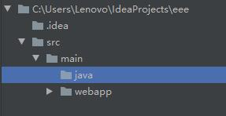

# 第01节：spring_mvc概述
本章节主要讲解spring_mvc的简单概述和创建第一个项目实践

### 一、1、 SpringMVC是什么
SpringMVC 是 Spring 框架内置的 MVC 的实现。SpringMVC 就是一个 Spring 内置的 MVC 子框架

Spring 子框架：意味着 SpringMVC 的包都在 Spring 框架里面。

MVC：Model-View-Control（模型--视图--控制器），这是一个解决页面代码（视图代码）和后台代码分离的设计思想。

### 二、SpringMVC的作用
MVC 模式（Model-View-Controller）：为了解决页面代码和后台代码的分离。

既然 SpringMVC 是一个 MVC 框架，首先就要解决 MVC 理念提出的问题。页面代码和后台代码分离。

### 三、 为什么要学习 SpringMVC
问题：我们已经学习了 Servlet/JSP 了。为什么还要学习 SpringMVC 呢？

我们知道，Servlet /JSP就是一套MVC模式的实现！！SpringMVC也是MVC的实现，那么学SpringMVC的意义在哪里？

SpringMVC不仅仅是MVC的实现，它还是一个框架。这意味着，除了MVC的实现以外还提供了大量的辅助页面请求处理的功能组件！！！
* 支持直接一个方法对一个请求
* 支持数据的自动封装  
* 自动支持上传组件
* 自动支持JSON的转成

### 四、SpringMVC 配置流程图
学习任何框架，从配置流程图开始。所以我们必须要理解SpringMVC的配置流程。（重点）

因为一个框架有很多API，入门流程图告诉我们，我们必须要掌握的API（一般超过5个类）。这样，我们可以做到，简单入门，深入学习！！！


概念说明：
* 核心控制器：因为SpringMVC为了实现一个请求对一个方法这个功能，所以必须需要一个Web组件来拦截所有请求。这个拦截并且处理所有请求的Web组件称为核心控制器。
* 业务控制器（Controller），在SpringMVC经过核心控制器跳转到一个处理自身需求业务的普通类，这个类称为业务控制器。

配置流程图说明：
* 我们必须在网站的入口（web.xml,WEB描述符），配置一个核心控制器，拦截所有的的请求
* 核心控制器通过加载Spring配置文件，获得请求路径对应业务控制器的方法
* 业务控制器的方法返回一个ModelAndView的对象给核心控制器
* 核心控制器根据业务控制器再加载配置的视图解释器跳转到对应的返回视图
### 五、我的第一个spring-MVC程序
#### 一、创建项目
##### 1、IDEA创建项目
新建一个maven project，并且选择webapp原型。

然后点击next

这里的GroupId和ArtifactID随意填写，但是ArtifactID最好和你的项目一名一样然后next

为了快一点创建，我们添加一个属性值，如图中亮的所示，点右边的加号，name=archetypeCatalog value=internal。
这里我们选择使用IDEA自带的maven，下面的两个分别是你的maven配置文件和你的仓库地址，我记得idea的maven一开始是没有setting.xml的，所以你要去maven的目录里面拷一份setting.xml到你的仓库中。idea的maven在安装路径的plugins文件夹下，即X:\xxx\JetBrains\IntelliJ IDEA 2016.3.2\plugins\plugins\maven\lib\maven3\conf\setting.xml拷贝到你的用户文件夹下的.m2文件夹下，为了之后能够快速的下载依赖包，我们要加一个官方库的镜像，因为maven的官方仓库在国外，太慢了。

我们在你的.m2文件夹下的setting.xml中添加如下代码：
``` java
<mirror>
    <id>alimaven</id>
    <mirrorOf>central</mirrorOf>
    <name>aliyun maven</name>
   <url>http://maven.aliyun.com/nexus/content/repositories/central/</url>
</mirror>
```

具体位置如下图所示:

这个是阿里的库，所以很快。做完之后我们回到idea，点击next，然后填写项目名，然后finish。
接下来idea开始创建项目，这里你要把maven自动导入打开。


然后等待maven创建项目成功


这样我们的项目初始的框架就弄好了。

##### 2、配置项目结构

创建好之后的项目目录如图所示


之后导入jar包。
下面在WEB-INF里创建一个springmvc核心配置文件因为maven目录结构并不是严格的maven格式,少了java源码文件夹
首先在main文件夹下创建一个文件夹，名称为java如下:



将java文件夹标识为Source Root 如下操作
然后apply -> ok

[images](../images/1401_image.jpg)

可以看到文件夹的颜色变了，设置完成~

##### 3、SpringMVC框架配置
进行完上面的配置，那就说明现在基本的开发环境已经搭建好了，现在要开始进行Spring
MVC的网站开发。


1、Maven自动导入jar包
Maven所做的工作很简单，就是自动把你需要的jar包下载到本地，然后关联到项目中来.
如果不使用Maven的话，那就需要去官网下载相关的jar包，然后导入到项目中。现在使用Maven的话，就不需要上网找jar包了。

``` java
<properties>
    <project.build.sourceEncoding>UTF-8</project.build.sourceEncoding>
    <maven.compiler.source>1.8</maven.compiler.source>
    <maven.compiler.target>1.8</maven.compiler.target>
    <spring.version>5.0.2.RELEASE</spring.version>
  </properties>

  <dependencies>
    <dependency> 
        <groupId>org.springframework</groupId> 
        <artifactId>spring-context</artifactId> 
        <version>${spring.version}</version> 
        </dependency> <dependency> 
        <groupId>org.springframework</groupId> 
        <artifactId>spring-web</artifactId> 
        <version>${spring.version}</version> 
        </dependency> <dependency> 
        <groupId>org.springframework</groupId> 
        <artifactId>spring-webmvc</artifactId> 
        <version>${spring.version}</version> 
        </dependency> <dependency> 
        <groupId>javax.servlet</groupId> 
        <artifactId>servlet-api</artifactId> 
        <version>2.5</version> <scope>provided</scope> 
        </dependency> <dependency> 
        <groupId>javax.servlet.jsp</groupId>    <artifactId>jsp-api</artifactId> 
        <version>2.0</version> 
        <scope>provided</scope> 
        </dependency>
  </dependencies>
```

这里我用的jar是5.0.2.RELEASE版本

2、 配置核心的控制器（配置DispatcherServlet）
在web.xml配置文件中核心控制器DispatcherServlet

```java
<!-- SpringMVC的核心控制器 --> 
<servlet> 
<servlet-name>dispatcherServlet</servlet-name> 
<servlet-class>org.springframework.web.servlet.DispatcherServlet</servlet- class> 
<!-- 配置Servlet的初始化参数，读取springmvc的配置文件，创建spring容器 --> 
<init-param>
<param-name>contextConfigLocation</param-name> 
<param-value>classpath:springmvc.xml</param-value> 
</init-param> 
<!-- 配置servlet启动时加载对象 --> 
<load-on-startup>1</load-on-startup> 
</servlet> 
<servlet-mapping> 
<servlet-name>dispatcherServlet</servlet-name> 
<url-pattern>/</url-pattern> 
</servlet-mapping>
```

3. 编写resources.springmvc.xml的配置文件
```java
<?xml version="1.0" encoding="UTF-8"?> 
<beans xmlns="http://www.springframework.org/schema/beans" 
xmlns:mvc="http://www.springframework.org/schema/mvc" 
xmlns:context="http://www.springframework.org/schema/context" 
xmlns:xsi="http://www.w3.org/2001/XMLSchema-instance" xsi:schemaLocation=" 
http://www.springframework.org/schema/beans 
http://www.springframework.org/schema/beans/spring-beans.xsd 
http://www.springframework.org/schema/mvc 
http://www.springframework.org/schema/mvc/spring-mvc.xsd \
http://www.springframework.org/schema/context http://www.springframework.org/schema/context/spring-context.xsd"> 
<!-- 配置spring创建容器时要扫描的包 --> 
<context:component-scan base-package="com.itheima"></context:component-scan> 
<!-- 配置视图解析器 --> 
<bean id="viewResolver" 
class="org.springframework.web.servlet.view.InternalResourceViewResolver"> 
<property name="prefix" value="/WEB-INF/pages/"></property> 
<property name="suffix" value=".jsp"></property> 
</bean> 
<!-- 配置spring开启注解mvc的支持 
<mvc:annotation-driven></mvc:annotation-driven>--> 
</beans>
```

4. 编写index.jsp和HelloController控制器类
1. 在WEB-INF下创建index.jsp

``` java
<body>
<h3>入门案例</h3> 

<a href="${ pageContext.request.contextPath }/hello">入门案例</a> 
</body>
```

2. 在Java文件下创建一个包,包名叫cn.stcart.contrller,把代码他下面的HelloController中

``` java
package cn.itcast.controller;

import org.springframework.stereotype.Controller; 

import org.springframework.web.bind.annotation.RequestMapping; 

/**
* 控制器 
* @author rt 
*/ 
@Controller 
public class HelloController { 
    /**
    * 接收请求 
    * @return 
    */ 
    @RequestMapping(path="/hello") 
    public String sayHello() { 
        System.out.println("Hello SpringMVC!!"); 
        return "success"; 
    } 
}
```

5. 在WEB-INF目录下创建pages文件夹，编写success.jsp的成功页面

``` java
<body>
    <h3>入门成功！！</h3> 
</body>
```

6. 启动Tomcat服务器，进行测试

### 六、入门案例的执行过程分析
入门案例的执行流程

* 1. 当启动Tomcat服务器的时候，因为配置了load-on-startup标签，所以会创建DispatcherServlet对象，
就会加载springmvc.xml配置文件
* 2. 开启了注解扫描，那么HelloController对象就会被创建
* 3. 从index.jsp发送请求，请求会先到达DispatcherServlet核心控制器，根据配置@RequestMapping注解
找到执行的具体方法
* 4. 根据执行方法的返回值，再根据配置的视图解析器，去指定的目录下查找指定名称的JSP文件
* 5. Tomcat服务器渲染页面，做出响应

2. SpringMVC官方提供图形

</r>

3. 入门案例中的组件分析
* 1. 前端控制器（DispatcherServlet） 
* 2. 处理器映射器（HandlerMapping） 
* 3. 处理器（Handler） 
* 4. 处理器适配器（HandlAdapter） 
* 5. 视图解析器（View Resolver） 
* 6. 视图（View）