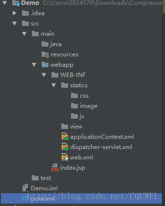
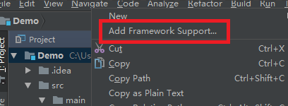
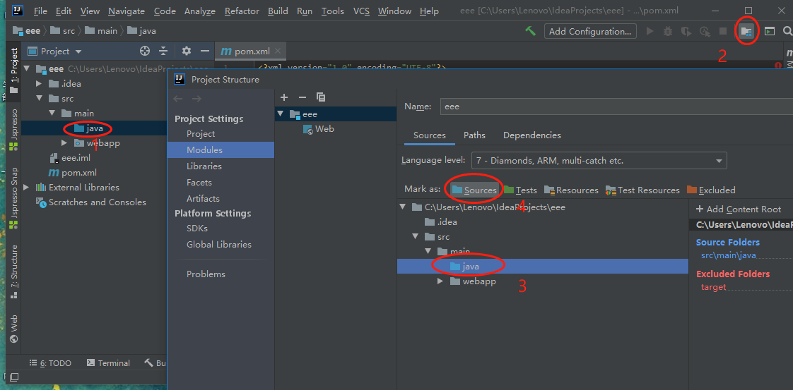

# 第01节：spring_mvc概述
本章节主要讲解spring_mvc的简单概述和创建第一个项目实践

### 一、1、 SpringMVC是什么
SpringMVC 是 Spring 框架内置的 MVC 的实现。SpringMVC 就是一个 Spring 内置的 MVC 子框架

Spring 子框架：意味着 SpringMVC 的包都在 Spring 框架里面。

MVC：Model-View-Control（模型--视图--控制器），这是一个解决页面代码（视图代码）和后台代码分离的设计思想。

### 二、SpringMVC的作用
MVC 模式（Model-View-Controller）：为了解决页面代码和后台代码的分离。

既然 SpringMVC 是一个 MVC 框架，首先就要解决 MVC 理念提出的问题。页面代码和后台代码分离。

### 三、 为什么要学习 SpringMVC
问题：我们已经学习了 Servlet/JSP 了。为什么还要学习 SpringMVC 呢？

我们知道，Servlet /JSP就是一套MVC模式的实现，SpringMVC也是MVC的实现，那么学SpringMVC的意义在哪里？

SpringMVC不仅仅是MVC的实现，它还是一个框架。这意味着，除了MVC的实现以外还提供了大量的辅助页面请求处理的功能组件。
* 支持直接一个方法对一个请求
* 支持数据的自动封装  
* 自动支持上传组件
* 自动支持JSON的转成

### 四、SpringMVC 配置流程图
* 学习任何框架，从配置流程图开始。所以我们必须要理解SpringMVC的配置流程。

因为一个框架有很多API，入门流程图告诉我们，我们必须要掌握的API（一般超过5个类）。这样，我们可以做到，简单入门，深入学习。


概念说明：
* 核心控制器：因为SpringMVC为了实现一个请求对一个方法这个功能，所以必须需要一个Web组件来拦截所有请求。这个拦截并且处理所有请求的Web组件称为核心控制器。
* 业务控制器（Controller），在SpringMVC经过核心控制器跳转到一个处理自身需求业务的普通类，这个类称为业务控制器。

配置流程图说明：
* 我们必须在网站的入口（web.xml,WEB描述符），配置一个核心控制器，拦截所有的的请求
* 核心控制器通过加载Spring配置文件，获得请求路径对应业务控制器的方法
* 业务控制器的方法返回一个ModelAndView的对象给核心控制器
* 核心控制器根据业务控制器再加载配置的视图解释器跳转到对应的返回视图
### 五、我的第一个spring-MVC程序
#### 一、创建项目
##### 1、IDEA创建项目
新建一个maven project，并且选择webapp原型。  
  
然后点击next  
  
这里的GroupId和ArtifactID随意填写，但是ArtifactID最好和你的项目一名一样然后next  
  
为了快一点创建，我们添加一个属性值，如图中亮的所示，点右边的加号，name=archetypeCatalog value=internal。  
idea的maven一开始是没有setting.xml的，所以你要去maven的目录里面拷一份setting.xml到你的仓库中。  
idea的maven在安装路径的plugins文件夹下，即X:\xxx\JetBrains\IntelliJ IDEA 2016.3.2\plugins\plugins\maven\lib\maven3\conf\setting.xml拷贝到你的用户文件夹下的.m2文件夹下。  
为了之后能够快速的下载依赖包，我们要加一个官方库的镜像，因为maven的官方仓库在国外，太慢了。  

我们在你的.m2文件夹下的setting.xml中添加如下代码：  
``` xml
<mirror>
    <id>alimaven</id>
    <mirrorOf>central</mirrorOf>
    <name>aliyun maven</name>
   <url>http://maven.aliyun.com/nexus/content/repositories/central/</url>
</mirror>
```

具体位置如下图所示:  
  
这个是阿里的库，所以很快。做完之后我们回到idea，点击next，然后填写项目名，然后finish。  
接下来idea开始创建项目，这里你要把maven自动导入打开。  
  

然后等待maven创建项目成功  
  

这样我们的项目初始的框架就弄好了。  

##### 2、添加pom依赖 

创建好之后的项目目录如图所示  

  

我们打开其中的pom.xml，添加我们的依赖。这里我把我的依赖全部放出来，复制到你的pom.xml的dependencies标签之间就可以了，pom文件中也会给你一个示例。  

我的依赖如下  

``` xml
<!--测试-->
    <dependency>
      <groupId>junit</groupId>
      <artifactId>junit</artifactId>
      <version>4.12</version>
      <scope>test</scope>
    </dependency>
    <!--日志-->
    <dependency>
      <groupId>org.slf4j</groupId>
      <artifactId>slf4j-log4j12</artifactId>
      <version>1.7.21</version>
    </dependency>
    <!--J2EE-->
    <dependency>
      <groupId>javax.servlet</groupId>
      <artifactId>javax.servlet-api</artifactId>
      <version>3.1.0</version>
    </dependency>
    <dependency>
      <groupId>javax.servlet.jsp</groupId>
      <artifactId>jsp-api</artifactId>
      <version>2.2</version>
    </dependency>
    <dependency>
      <groupId>javax.servlet</groupId>
      <artifactId>jstl</artifactId>
      <version>1.2</version>
    </dependency>
    <!--mysql驱动包-->
    <dependency>
      <groupId>mysql</groupId>
      <artifactId>mysql-connector-java</artifactId>
      <version>5.1.35</version>
    </dependency>
    <!--springframework-->
    <dependency>
      <groupId>org.springframework</groupId>
      <artifactId>spring-web</artifactId>
      <version>4.2.6.RELEASE</version>
    </dependency>
    <dependency>
      <groupId>org.springframework</groupId>
      <artifactId>spring-webmvc</artifactId>
      <version>4.2.6.RELEASE</version>
    </dependency>
    <dependency>
      <groupId>org.springframework</groupId>
      <artifactId>spring-context</artifactId>
      <version>4.2.6.RELEASE</version>
    </dependency>
    <dependency>
      <groupId>org.springframework</groupId>
      <artifactId>spring-test</artifactId>
      <version>4.2.6.RELEASE</version>
    </dependency>
      <dependency>
          <groupId>org.springframework</groupId>
          <artifactId>spring-jdbc</artifactId>
          <version>4.2.6.RELEASE</version>
      </dependency>
    <dependency>
      <groupId>com.github.stefanbirkner</groupId>
      <artifactId>system-rules</artifactId>
      <version>1.16.1</version>
      <scope>test</scope>
    </dependency>
    <dependency>
      <groupId>org.aspectj</groupId>
      <artifactId>aspectjweaver</artifactId>
      <version>1.8.9</version>
    </dependency>
    <!--其他需要的包-->
    <dependency>
        <groupId>org.apache.commons</groupId>
        <artifactId>commons-lang3</artifactId>
        <version>3.4</version>
    </dependency>
    <dependency>
        <groupId>commons-fileupload</groupId>
        <artifactId>commons-fileupload</artifactId>
        <version>1.3.1</version>
    </dependency>
```
一旦你复制过去之后，maven就会开始下载相应的jar文件，等待下载完成即可。可能包有点多，不过用了阿里的镜像之后还是挺快的。  

###### 3、添加框架支持

配置完pom.xml之后，我们在idea中要添加一下框架的支持。  
右击我们的项目文件夹，选择add framework support  
  
然后在窗口中分别选中spring和springmvc，并且选择spring是，记得勾选springconfig.xml
  

因为我们之前下载过相应的文件，所以这里直接用我们下载好的spring文件。
点击ok之后，我们会发现WEB-INF文件夹下多出了两个文件  

  


这个就是我们之后要配置的文件，先不用管。
##### 4、完善目录结构 

首先我们在src/main文件夹下创建java文件夹，你会发现这个文件夹不能创建java的类文件和package，别急，先把必须的文件夹全部创建好。请按照下图创建文件夹  
  

然后我们进入project structure选择文件夹的作用，在界面的右上角进入project structure  
  

然后在module中选择设置各个模块，其中java文件夹是 sources，test是Test，改完之后，点ok，文件夹会变色，那就成功了。  
  
然后java文件夹中添加需要的包。最后的完整目录如下  
  

<!-- 之后导入jar包。  
下面在WEB-INF里创建一个springmvc核心配置文件因为maven目录结构并不是严格的maven格式,少了java源码文件夹
首先在main文件夹下创建一个文件夹，名称为java如下:  

  

将java文件夹标识为Source Root 如下操作  
然后apply -> ok

  

可以看到文件夹的颜色变了，设置完成~   -->

### 六、基于XML 的配置

#### 1、配置web.xml

idea创建的web.xml这个文件版本比较低，所以我们要找一个新的。把我的文件直接全部覆盖复制进去就可以了。  

``` xml
<?xml version="1.0" encoding="UTF-8"?>
<web-app xmlns="http://xmlns.jcp.org/xml/ns/javaee"
         xmlns:xsi="http://www.w3.org/2001/XMLSchema-instance"
         xsi:schemaLocation="http://xmlns.jcp.org/xml/ns/javaee http://xmlns.jcp.org/xml/ns/javaee/web-app_3_1.xsd"
         version="3.1">

    <display-name>Archetype Created Web Application</display-name>

    <!--welcome pages-->
    <welcome-file-list>
        <welcome-file>index.jsp</welcome-file>
    </welcome-file-list>

    <!--配置springmvc DispatcherServlet-->
    <servlet>
        <servlet-name>springMVC</servlet-name>
        <servlet-class>org.springframework.web.servlet.DispatcherServlet</servlet-class>
        <init-param>
            <!--配置dispatcher.xml作为mvc的配置文件-->
            <param-name>contextConfigLocation</param-name>
            <param-value>/WEB-INF/dispatcher-servlet.xml</param-value>
        </init-param>
        <load-on-startup>1</load-on-startup>
        <async-supported>true</async-supported>
    </servlet>
    <servlet-mapping>
        <servlet-name>springMVC</servlet-name>
        <url-pattern>/</url-pattern>
    </servlet-mapping>
    <!--把applicationContext.xml加入到配置文件中-->
    <context-param>
        <param-name>contextConfigLocation</param-name>
        <param-value>/WEB-INF/applicationContext.xml</param-value>
    </context-param>
    <listener>
        <listener-class>org.springframework.web.context.ContextLoaderListener</listener-class>
    </listener>
</web-app>
```
上面代码的意思主要就是创建一个中央的控制器，都有简单的注释，如果有需要，请自行百度。  

#### 2、配置dispatcher-servlet.xml

这个文件负责mvc的配置。

``` xml
<?xml version="1.0" encoding="UTF-8"?>
<beans xmlns="http://www.springframework.org/schema/beans"
       xmlns:xsi="http://www.w3.org/2001/XMLSchema-instance"
       xmlns:context="http://www.springframework.org/schema/context"
       xmlns:mvc="http://www.springframework.org/schema/mvc"
       xsi:schemaLocation="http://www.springframework.org/schema/beans http://www.springframework.org/schema/beans/spring-beans.xsd http://www.springframework.org/schema/context http://www.springframework.org/schema/context/spring-context.xsd http://www.springframework.org/schema/mvc http://www.springframework.org/schema/mvc/spring-mvc.xsd">
    <!--此文件负责整个mvc中的配置-->

    <!--启用spring的一些annotation -->
    <context:annotation-config/>

    <!-- 配置注解驱动 可以将request参数与绑定到controller参数上 -->
    <mvc:annotation-driven/>

    <!--静态资源映射-->
    <!--本项目把静态资源放在了webapp的statics目录下，资源映射如下-->
    <mvc:resources mapping="/css/**" location="/WEB-INF/statics/css/"/>
    <mvc:resources mapping="/js/**" location="/WEB-INF/statics/js/"/>
    <mvc:resources mapping="/image/**" location="/WEB-INF/statics/image/"/>

    <!-- 对模型视图名称的解析，即在模型视图名称添加前后缀(如果最后一个还是表示文件夹,则最后的斜杠不要漏了) 使用JSP-->
    <!-- 默认的视图解析器 在上边的解析错误时使用 (默认使用html)- -->
    <bean id="defaultViewResolver" class="org.springframework.web.servlet.view.InternalResourceViewResolver">
        <property name="viewClass" value="org.springframework.web.servlet.view.JstlView"/>
        <property name="prefix" value="/WEB-INF/view/"/><!--设置JSP文件的目录位置-->
        <property name="suffix" value=".jsp"/>
        <property name="exposeContextBeansAsAttributes" value="true"/>
    </bean>

    <!-- 自动扫描装配 -->
    <context:component-scan base-package="example.controller"/>
</beans>
```

直接复制即可，都有注释，如果有需要，请自行百度。  

#### 3、 配置applicationContext.xml  

其实这个文件没什么好配置的，这个文件主要负责一些非mvc组件（或者其他组件）的配置，暂时没有，所以是空的，但你也可以扫描一下。

``` xml
<?xml version="1.0" encoding="UTF-8"?>
<beans xmlns="http://www.springframework.org/schema/beans"
       xmlns:xsi="http://www.w3.org/2001/XMLSchema-instance"
       xmlns:context="http://www.springframework.org/schema/context"
       xsi:schemaLocation="http://www.springframework.org/schema/beans http://www.springframework.org/schema/beans/spring-beans.xsd http://www.springframework.org/schema/context http://www.springframework.org/schema/context/spring-context.xsd">
    <context:component-scan base-package="example"/>
</beans>
```
#### 4、 测试 
三个配置文件配置好之后，就可以测试了。首先在controller文件夹下创建一个IndexController，代码如下：
``` java
@Controller
@RequestMapping("/home")
public class IndexController {

    @RequestMapping("/index")
    public String index() {
        return "index";
    }
}
```
views文件夹下创建index.jsp，statics/css/下创建test.css
``` xml
<%@ taglib prefix="c" uri="http://java.sun.com/jsp/jstl/core" %>
<%@ page contentType="text/html;charset=UTF-8" language="java" %>
<html>
<head>
    <title>Index</title>
    <link rel="stylesheet" type="text/css" href="<c:url value="/css/test.css"/> "/>
</head>
<body>
<p>Spring MVC based on XML config success!</p>
</body>
</html>
```
``` css
p{
    background-color: brown;
    font-family: "Courier New";
    font-size:100px;
}
```

接下来配置tomcat启动服务器后启动tomcat。
  
至此成功创建SpingMVC项目

### 六、入门案例的执行过程分析

#### 入门案例的执行流程  

* 1. 当启动Tomcat服务器的时候，因为配置了load-on-startup标签，所以会创建DispatcherServlet对象，
就会加载springmvc.xml配置文件
* 2. 开启了注解扫描，那么HelloController对象就会被创建
* 3. 从index.jsp发送请求，请求会先到达DispatcherServlet核心控制器，根据配置@RequestMapping注解
找到执行的具体方法
* 4. 根据执行方法的返回值，再根据配置的视图解析器，去指定的目录下查找指定名称的JSP文件
* 5. Tomcat服务器渲染页面，做出响应


#### 入门案例中的组件分析  
* 1. 前端控制器（DispatcherServlet） 
* 2. 处理器映射器（HandlerMapping） 
* 3. 处理器（Handler） 
* 4. 处理器适配器（HandlAdapter） 
* 5. 视图解析器（View Resolver） 
* 6. 视图（View）