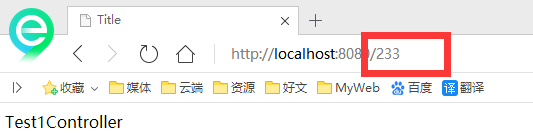

# 第03节：控制器Controller
之前一节我们了解了spring_mvc的执行过程本章节一起来了解Controller的实现

### 控制器Controller
控制器复杂提供访问应用程序的行为，通常通过接口定义或注解定义两种方法实现。 控制器负责解析用户的请求并将其转换为一个模型。在Spring MVC中一个控制器类可以包含多个方法；

在SpringMVC中，对于Controller的配置方式有很多种;

#### 控制器实现方式：实现Controller接口
Controller是一个接口，在org.springframework.web.servlet.mvc包下，接口中只有一个方法；

``` java
//实现该接口的类获得控制器功能
public interface Controller {
    //处理请求且返回一个模型与视图对象
    ModelAndView handleRequest(HttpServletRequest var1, HttpServletResponse var2) throws Exception;
}
```

1.新建一个Maven的Web项目，导入相应jar包，保险起见，同之前一样，也需要处理资源过滤问题！

2.配置web.xml 中的 DispatcherServlet ，同之前一样

3.配置springmvc-servlet.xml

``` java
<?xml version="1.0" encoding="UTF-8"?>
<beans xmlns="http://www.springframework.org/schema/beans"
       xmlns:xsi="http://www.w3.org/2001/XMLSchema-instance"
       xmlns:context="http://www.springframework.org/schema/context"
       xmlns:mvc="http://www.springframework.org/schema/mvc"
       xsi:schemaLocation="http://www.springframework.org/schema/beans
         http://www.springframework.org/schema/beans/spring-beans.xsd
        http://www.springframework.org/schema/context
        http://www.springframework.org/schema/context/spring-context-4.3.xsd
        http://www.springframework.org/schema/mvc
        http://www.springframework.org/schema/mvc/spring-mvc-4.3.xsd">

    <!--=======SpringMVC_Start=======-->
    <!-- 视图解析器 -->
    <bean class="org.springframework.web.servlet.view.InternalResourceViewResolver"
          id="internalResourceViewResolver">
        <!-- 前缀 -->
        <property name="prefix" value="/WEB-INF/jsp/" />
        <!-- 后缀 -->
        <property name="suffix" value=".jsp" />
    </bean>
    <!--=======SpringMVC_END=======-->

</beans>
```

4.编写一个Controller类

注意点：不要导错包，实现Controller接口，重写方法；

``` java
//定义控制器
public class Test1Controller implements Controller {
    @Override
    public ModelAndView handleRequest(HttpServletRequest httpServletRequest, HttpServletResponse httpServletResponse) throws Exception {
        //返回一个模型视图对象
        ModelAndView mv = new ModelAndView();
        mv.addObject("msg","Test1Controller");
        mv.setViewName("test");
        return mv;
    }
}
```

编写完毕后，去Spring配置文件中注册请求的bean；name对应请求路径，class对应处理请求的类

``` java
<bean name="/233" class="com.kuang.controller.Test1Controller"/>
```

 5.编写前端test.jsp，注意在WEB-INF/jsp目录下编写，对应我们的视图解析器

 ``` java
<%@ page contentType="text/html;charset=UTF-8" language="java" %>
<html>
<head>
    <title>Kuangshen</title>
</head>
<body>
    ${msg}
</body>
</html>
 ```

6.配置Tomcat运行测试，我这里没有项目发布名配置的就是一个 /，所以请求不用加项目名，OK！



实现接口Controller定义控制器是较老的办法，缺点是：一个控制器中只有一个方法，如果要多个方法则需要定义多个Controller；定义的方式比较麻烦；

#### 使用注解@Controller定义控制器
@Controller注解类型用于声明Spring类的实例是一个控制器（在讲IOC时还提到了另外3个注解）；

Spring可以使用扫描机制来找到应用程序中所有基于注解的控制器类，为了保证Spring能找到你的控制器，需要在配置文件中声明组件扫描。

``` java
<!-- 自动扫描指定的包，下面所有注解类交给IOC容器管理 -->
<context:component-scan base-package="com.kuang.controller"/>
```

修改我们的TestController类，使用注解实现；

``` java
//@Controller注解的类会自动添加到Spring上下文中
@Controller
public class Test1Controller{

    //映射访问路径
    @RequestMapping("/233")
    public String index(Model model){
        //Spring MVC会自动实例化一个Model对象用于向视图中传值
        model.addAttribute("msg", "注解");
        //返回视图位置
        return "test";
    }
}
```

运行tomcat测试


可以发现，我们的两个请求都可以指向一个视图，但是页面结果的结果是不一样的，从这里可以看出视图是被复用的，而控制器与视图之间是弱偶合关系。

#### @RequestMapping
@RequestMapping注释用于映射url到控制器类或一个特定的处理程序方法。可用于类或方法上。用于类上，表示类中的所有响应请求的方法都是以该地址作为父路径。

只注解在方法上面

``` java
@Controller
public class TestController {
    @RequestMapping("/h1")
    public String test(){
        return "test";
    }
}
```

访问路径：http://localhost:8080/项目名/h1

同时注解类与方法

``` java
@Controller
@RequestMapping("/admin")
public class TestController {
    @RequestMapping("/h1")
    public String test(){
        return "test";
    }
}
```

访问路径：http://localhost:8080/项目名/admin/h1  , 需要先指定类的路径再指定方法的路径；


上面的控制器配置，一般情况下我们都是用注解去完成路径映射，配置十分方便.