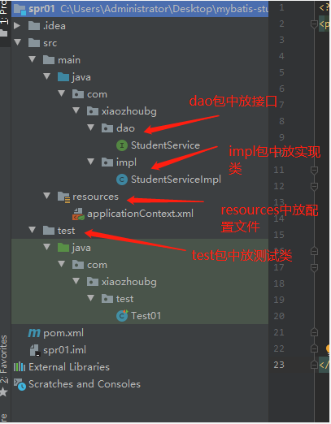

# 第02节：第一个spring项目

咱们这里使用spring 5.x的版本，要使用该版本的话，需要保证你的jdk是8以上。

### 一、创建项目添加jar包

（我这个用的是jdk8）  

首先当然还是引用jar包，咱们这里可以手动去下载引用jar包，也可以创建maven项目便捷下载jar包。  
咱们实在没有必要去手动下载jar包，所以说咱们依然用maven来便捷下载jar包。  

在项目的pom.xml中添加spring jar包。直接创建即可，这个不用选什么webapp之类的模板了。

``` xml
<dependencies>
    <!-- spring jar包 -->
        <dependency>
            <groupId>org.springframework</groupId>
            <artifactId>spring-context</artifactId>
            <version>5.0.4.RELEASE</version>
        </dependency>
        <!-- junit jar包，因为后续会用到单元测试 -->
        <dependency>
            <groupId>junit</groupId>
            <artifactId>junit</artifactId>
            <version>4.12</version>
        </dependency>
    </dependencies>
```

### 二、编写接口与实现类

首先给大家看一下我的目录



创建接口

``` java
// StudentService
package com.xiaozhoubg.dao;

public interface StudentService {

    void study();
}
```

创建实现类StudentServiceimpl

``` java
// StudentServiceimpl
package com.xiaozhoubg.impl;

import com.xiaozhoubg.dao.StudentService;

public class StudentServiceImpl implements StudentService {
    public void study() {
            System.out.println("好好学习天天向上");
    }
}

```

### 三、编写配置文件测试运行

在maven项目的resources目录下添加spring配置文件，文件名可以随意命名，这里命名为：applicationContext.xml
里面需要添加一些xsd地址。这个咱们直接复制我的就可以了

``` xml
<!-- applicationContext.xml -->
<beans xmlns="http://www.springframework.org/schema/beans"
       xmlns:xsi="http://www.w3.org/2001/XMLSchema-instance"
       xmlns:aop="http://www.springframework.org/schema/aop"
       xmlns:context="http://www.springframework.org/schema/context"
       xsi:schemaLocation="http://www.springframework.org/schema/beans
    http://www.springframework.org/schema/beans/spring-beans.xsd
    http://www.springframework.org/schema/aop
    http://www.springframework.org/schema/aop/spring-aop.xsd
    http://www.springframework.org/schema/context
    http://www.springframework.org/schema/context/spring-context.xsd">

    <bean id="studentService" class="com.xiaozhoubg.impl.StudentServiceImpl"/>
</beans>
```

在该spring配置文件中添加bean标签：

* id：该属性是Bean的唯一标识，java程序通过id访问该Bean。
* class：指定该Bean所属的类，这里只能是类，不能是接口。
创建测试类运行Test01

创建Test01类进行测试
想要使用StudentService的话，需要开发者自己手动通过new关键字创建该接口实现类的对象。虽然使用了接口可以实现程序的解耦，但是实际上在代码中还是有new StudentServiceImpl的语句，这个地方还是存在一些耦合的。例如咱们之前的面向对象第三章第07节。

使用spring之后，在代码中通过spring获取StudentServiceImpl对象，这样子就去掉了之前代码中的耦合。

```  java
// Test01

package com.xiaozhoubg.test;

import com.xiaozhoubg.dao.StudentService;
import com.xiaozhoubg.impl.StudentServiceImpl;
import org.junit.Test;
import org.springframework.context.ApplicationContext;
import org.springframework.context.support.ClassPathXmlApplicationContext;

public class Test01 {

    /**
     * 以前的写法：手动创建对象
     */
    @Test
    public void oldType(){
        StudentService studentService = new StudentServiceImpl();
        studentService.study();
    }

    /**
     * 使用spring之后的写法：直接通过spring获取对象
     */
    @Test
    public void springType() {
        ApplicationContext context = new ClassPathXmlApplicationContext("applicationContext.xml");
        //从spring中获取对象
        StudentService studentService = (StudentService) context.getBean("studentService");
        studentService.study();
    }
}
```

#### 四、总结

不是通过过创建new关键字实现类对象。  
通过spring获取对象，这样写，就可以消除耦合了，这是spring中独有的写法。
这就是咱们第一节提到的降低耦合，下一节咱们学习IOC。